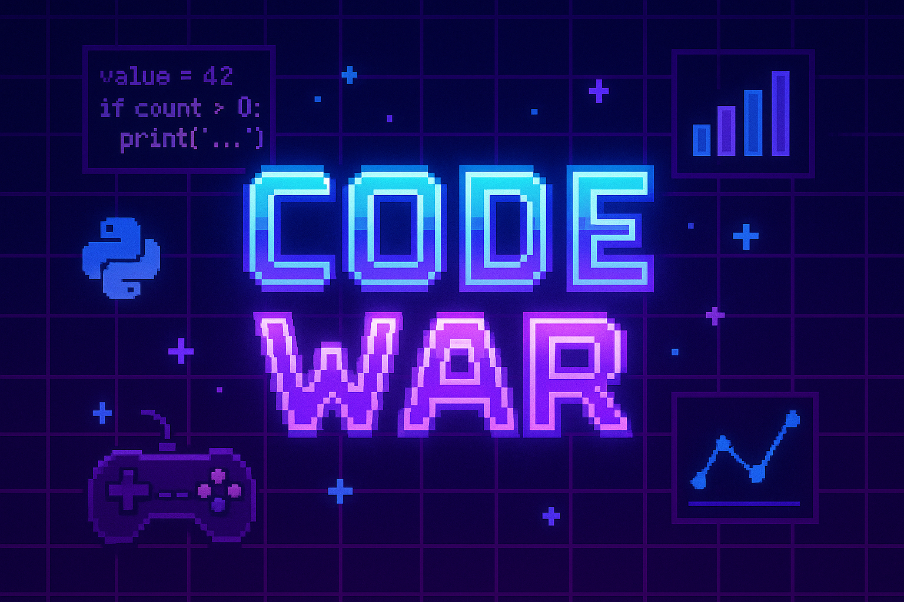

# 🏆 Code War: Edição Python + Análise de Dados

Seja bem-vindo(a) ao campeonato **Code War**! Esta edição é focada em habilidades práticas com **Python**, **análise de dados**, **boas práticas de desenvolvimento**, e **visualização**.

## Participantes

| Nome              | Repositório                                                                 | Pontuação |
|-------------------|------------------------------------------------------------------------------|----------------|
| [Ariane](https://github.com/Arii19) | [github.com/Arii19/CodeWarPython](https://github.com/Arii19/CodeWarPython) | _/5 |
| [IsadoraPrevitalle](https://github.com/IsadoraPrevitalle) | [github.com/IsadoraPrevitalle/CODEWAR](https://github.com/IsadoraPrevitalle/CODEWAR) | _/5 |
| [pedrowowbr](https://github.com/pedrowowbr) | [github.com/pedrowowbr/CodeWarPython2025](https://github.com/pedrowowbr/CodeWarPython2025) | _/5 |
| [Felipe Sardinha](https://github.com/felipesardinha19) | [github.com/felipesardinha19/CodeWarPython2025](https://github.com/felipesardinha19/CodeWarPython2025) | _/5 |